# Sunday Board

A calendar, task list, meal planner and shopping cart in one page. No build step
to run it, no server, no accounts, no dependencies — open `index.html` and it works.

It plans the week's meals, works out what to buy from the ingredients, adds up the
quantities, and tells you roughly what you're eating.

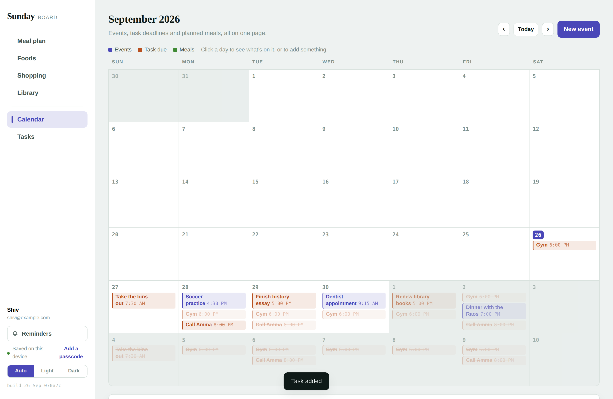

## What it does

**Calendar** — events with a time and notes. Task deadlines and planned meals show
up alongside them. Click a day to see what's on it.

**Tasks** — due date, time, notes, done. Anything with a due date lands on the
calendar. A task can also repeat: every day, every weekday, every weekend, weekly on
the day it is due, every 2 weeks, monthly on the same date, or a set of days you pick
yourself (Tuesday and Friday, say). Tick a repeating task and it rolls to the next
date rather than ending — its reminders re-arm, and it keeps a count of how many
times you have done it. The calendar shows each future occurrence too.

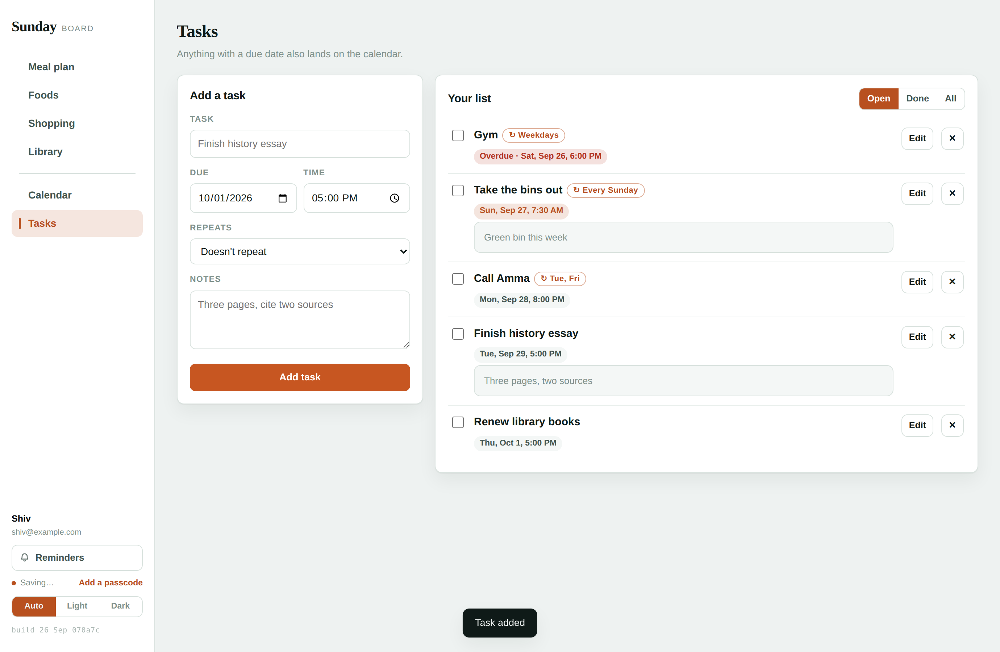

**Foods** — build a dish once from the ingredient library, and say which meals it
suits: breakfast, lunch, dinner, snack, any combination. Leave them all off and it
fits anything. Its nutrition and
grocery contribution follow it everywhere.

**Meal plan** — a week grid with breakfast, lunch, dinner and snack. Drag a food onto
a slot, or tap on a phone. Each day shows its calories and protein; click through for
the full read-out. The food rail has a search box — it matches a dish's name, its
notes and its ingredients — and a row of meal chips. Tap **Breakfast**, or the
BREAKFAST label on the grid itself, and the rail narrows to breakfast dishes.

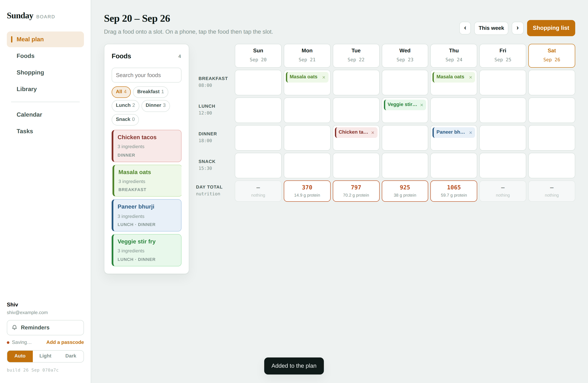

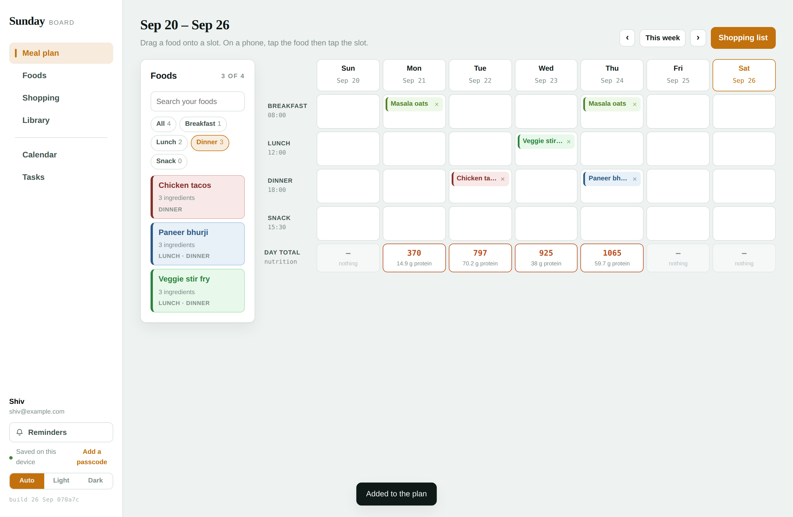

**Shopping** — the week's ingredients with quantities added up. Drag what you're
buying into the cart and tick things off as you go.

**Library** — 175 shelves, nested the way a house actually is:

```
House supplies › Kitchen supplies › Ingredients › Vegetables › Leaves & greens
```

Five roots — House supplies, Home & garden, Work & study, People & occasions, and
Mine. Pick a branch and it lists **every** shelf beneath it, supplies first and
ingredients after, 24 to a shelf with *Show all* per shelf; pick a shelf and you get
the lot in one go.

**Mine** fills itself: *Kept by you* (anything you starred), *Things you buy often*
(anything that has gone into the cart more than once, most often first), *In your
dishes* (what your own recipes lean on), *On repeat*, and *Added by you*. Shelves you
make yourself sit alongside them.

Two things put something there without you filing it. The **☆** on any library row
keeps that thing in Mine for good — press it again to let it go. And the first time
you cart something, the shelf it came from follows it: cart a bin bag and *Cleaning*
appears under Mine with all 394 of its things, so the next trip starts where the last
one left off. Hover a followed shelf and **×** drops it again.

The same shelf is offered where it is most useful — the recipe builder's ingredient
library has an **Everything / Mine** pair of tabs. Mine there ranks an ingredient by
how many of your dishes use it plus how often you have bought it, and the rows drag
onto the recipe exactly like the library's.

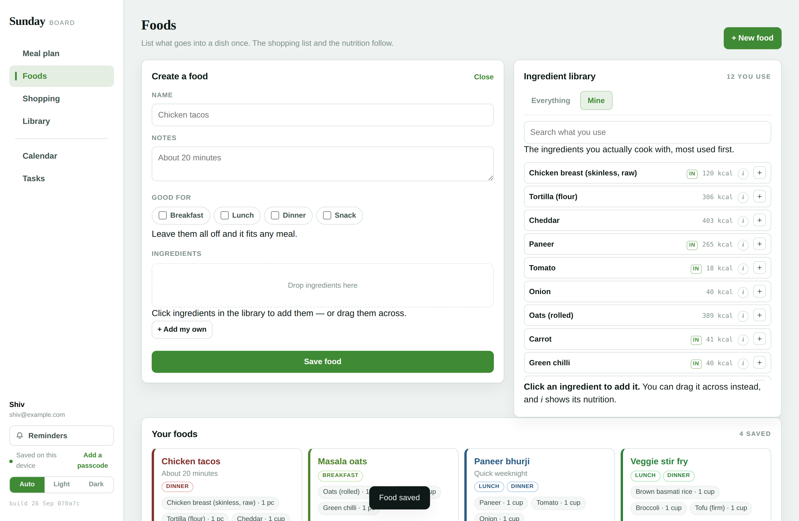 **+ New shelf** puts one of your own anywhere in the tree, including
inside another of your own, and **+ Add something here** files your own ingredient
onto whichever shelf you are standing on. Every row goes to the cart, straight into a
dish, or onto a repeat.

**Repeats** — give something a frequency and it arrives on its own. Cilantro every
Monday, milk every day, toilet roll on the 15th. The board can't run while it's
closed, so it looks backwards when you open it: the most recent due date that hasn't
been served yet gets served now, up to two months back.

**Suggestions** — what you buy most often, the ingredients your own dishes lean on,
and which dish to cook again. All of it read off your own history; before there is
any, it falls back to the things most kitchens run out of.

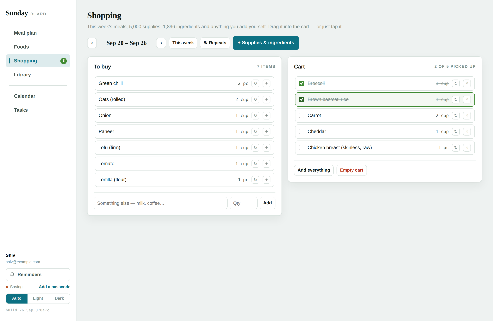

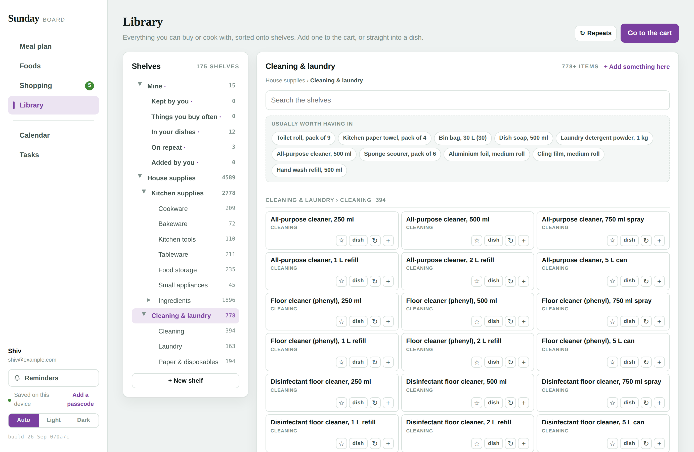

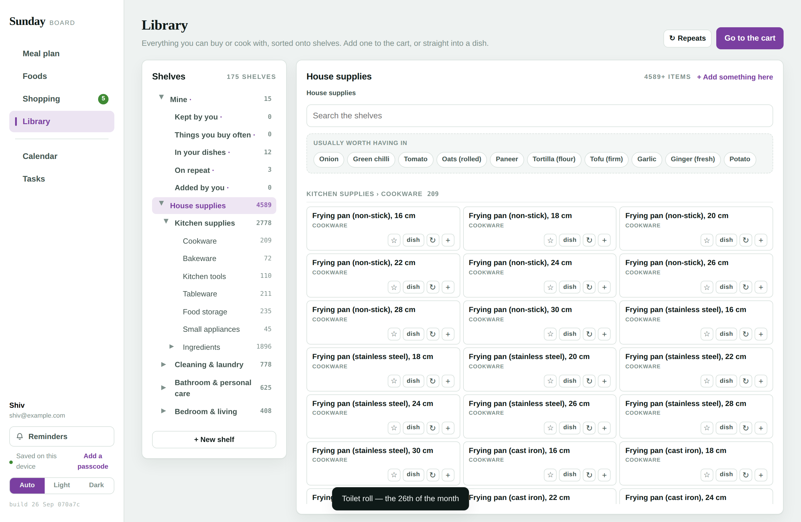

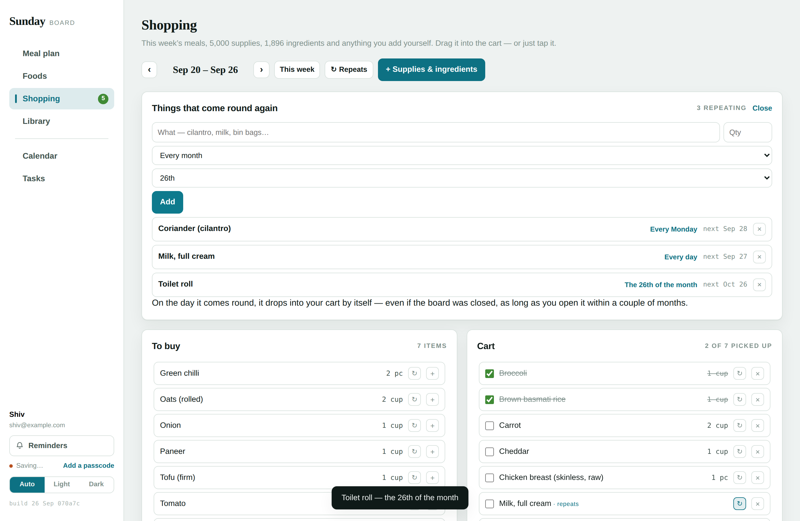

**Light and dark** — Auto, Light or Dark at the bottom of the rail. Auto follows
whatever the computer or phone is set to; the other two override it. The choice is
kept per device, not per board, and it is applied before the page paints, so the
sign-in screen comes up in the right colours too.

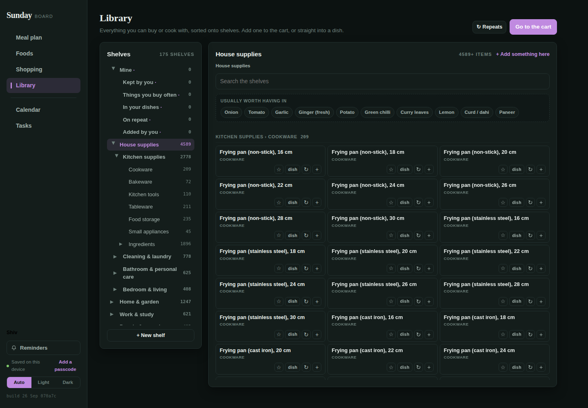

**Reminders** — one day before and thirty minutes before every event, task and meal,
plus a Sunday summary of the week's menu and shopping. They appear in the page and,
if you allow it, as desktop notifications. They fire while the page is open, and
anything missed in the last twelve hours is waiting when you come back.

## The ingredient library

5,299 ingredients across 27 cuisines, each with twelve nutrients per 100 g: energy,
protein, fibre, carbs, fat, saturated fat, sugars, sodium, potassium, calcium, iron
and vitamin C.

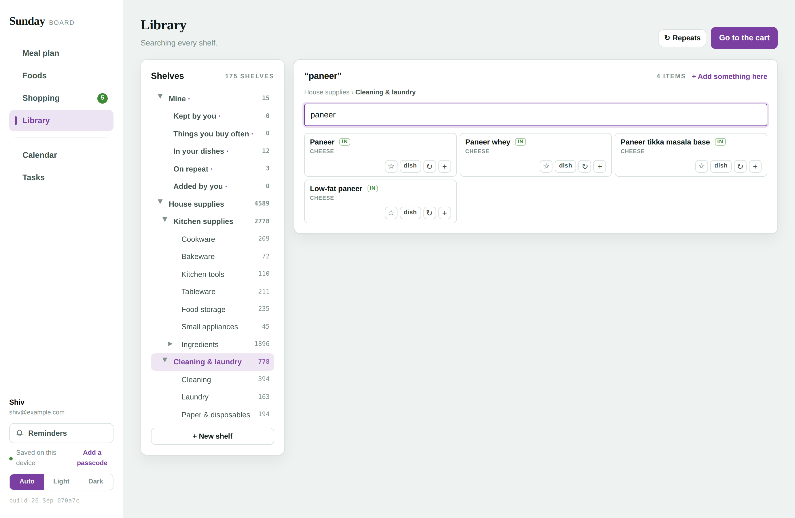

**1,896 of those are written out** in `src/data/ingredients.txt`, one per line:

```
name|group|kcal|protein|carb|fibre|sugar|fat|satfat|sodium|potassium|calcium|iron|vitC|units|cuisines
Toor dal (arhar, split)|Dals & pulses|343|22.3|62.8|15.5|2.8|1.7|0.4|17|1392|130|5.2|0|cup=200,tbsp=12|in
```

**The other 3,403 are cooked forms, derived at load time** — *boiled*, *grilled*,
*roasted*, *sautéed*, *deep-fried*, *steamed* — using yield and nutrient-retention
factors, the same approach food composition tables use. Dry toor dal is 343 kcal per
100 g; boiled it is about 127, because it nearly triples in weight. Raw potato is 77;
deep-fried it is 223, with the cooking oil counted in. Water-soluble vitamins drop
where they leach. Every derived entry says on its own card how it was worked out.

They are estimates, not measurements — dependable for common foods, approximate for
uncommon ones. The app says so where it matters. It is not medical advice.

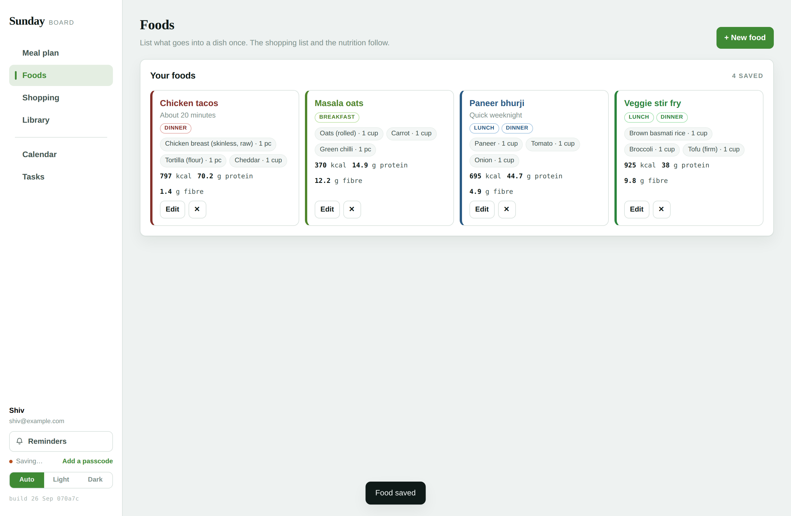

## Running it

Open `index.html`. That's it.

To serve it locally:

```bash
python3 -m http.server 8099
# then http://localhost:8099/
```

To host it, push this repo and turn on GitHub Pages (Settings → Pages → deploy from
`main`, root). `index.html` sits at the root, so nothing else is needed.

## Editing it

`index.html` is generated. Edit `src/sunday-board.html` — it carries a
`__INGREDIENT_TABLE__` placeholder so the page stays readable without 1,896 lines of
data in the middle of it — then:

```bash
python3 src/build.py
```

That injects the table and writes a standalone `index.html`, and stamps the build —
the date and a short hash of the page, printed at the bottom of the rail and echoed
by the build command. If the app in front of you doesn't show a stamp, you are
looking at the template rather than a built page.

## Tests

Real-browser tests through Playwright, asserting on what the page actually renders.
See [`tests/README.md`](tests/README.md). Serve over HTTP rather than `file://` —
browsers partition storage differently for file origins and the reminder tests give
false failures there.

## Where your data lives

In your browser, under `localStorage`, on the device you're using. Nothing is sent
anywhere.

The sign-in screen takes a name and an email, and offers an optional passcode. The
passcode is real: it derives an AES-256 key with PBKDF2 and encrypts the saved board,
so what's on disk is ciphertext. There is no reset — forget it and the board is gone,
which is why it's off by default.

## Layout

```
index.html              the whole app, generated — open this
src/sunday-board.html   the source page
src/build.py            injects both data tables, writes index.html
src/data/ingredients.txt  1,896 ingredients, pipe-delimited
src/data/supplies.txt     5,053 household supplies, pipe-delimited
src/gen_supplies.py       regenerates supplies.txt
tests/                  Playwright tests
docs/                   screenshots
```

## One board per person

Boards are keyed by a slug of the name, so **Shiv**, `shiv` and `  SHIV  ` all open
the same board, every time. Signing in under a name nobody has used makes a new board
beside the others — it never writes over one that exists. If more than one board is on
the device you get a picker on the way in; your name in the sidebar switches between
them, and each board saves itself before it hands over.

A passcode locks one board, not the device: a locked board shows as *locked* in the
picker and asks for its passcode when you choose it. Boards written by the earlier
single-board version are adopted by whoever their profile names the first time you
open this one.

```
sundayboard.users            the list of boards on this device
sundayboard.board.shiv       one board
sundayboard.board.priya      another, untouched by the first
```

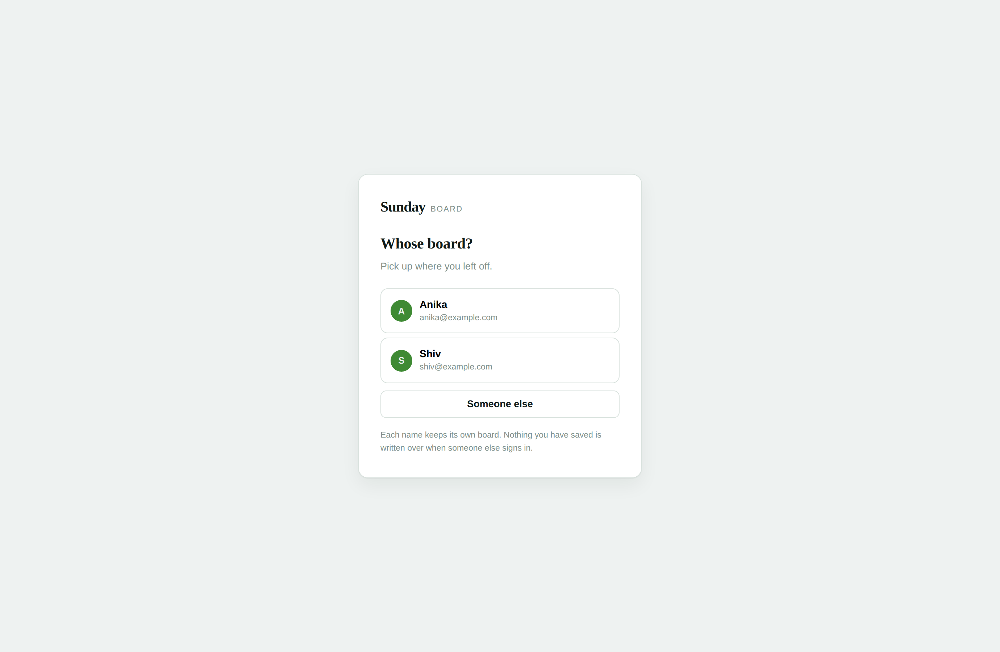

## The shelf tree

`SHELF_TREE` in the page describes the built-in branches; the 106 ingredient
categories hang under *House supplies › Kitchen supplies › Ingredients* grouped by
the 17 aisles the data ships with, and the 37 supply categories hang under the branch
each belongs to. Every node knows how to list its own things, and a branch lists
everything underneath it, so the counts add up as you climb.

Shelves you add yourself live in `state.myCats` as `{id, name, parent}` — the parent
is any node id, built-in or your own, which is what lets a shelf sit inside a shelf.
Your own things carry the id of the shelf they sit on.

## Categories

The 17 groups the ingredient data ships with are too coarse to browse — "Vegetables"
is 368 things. `subCategory()` in the page sorts every ingredient into one of **106
finer categories** you would actually go looking for: Leaves & greens, Gourds &
squash, Whole spices, Cured meats & sausages, Roots & tubers, Souring agents. They
are the shelves on the Library page, sorted under their aisle, and they work in
search too — typing `leaves` returns the whole leaf shelf, not just the things with
"leaf" in the name.

Supplies carry their 37 categories in the data file. Your own items carry whichever
category you file them under, new ones included.

## The supply library

5,053 household supplies in `src/data/supplies.txt`, one per line:

```
name|category|unit|tags
Bin bag, 30 L (30)|Cleaning|roll|
Agarbatti (incense sticks)|Pooja & festival|each|in
AA alkaline battery, pack of 8|Batteries & power|pack|
```

37 categories, from **Cleaning** and **Hardware** through **Plumbing**, **Office &
stationery**, **Pooja & festival**, **Pet supplies**, **Garden & outdoor** and
**Baby & kids**. `tags` marks the Indian-household staples. No nutrition here — a
supply is a thing you buy, not a thing you eat, so it carries a category and a
purchase unit and nothing more.

Regenerate it with `python3 src/gen_supplies.py`. The generator is the source of
truth: it holds the item lists and the size and pack variants they expand into.

## Known limits

- Reminders need the page open. A browser tab can't wake itself up; anything missed
  in the last twelve hours appears when you return.
- Nutrition covers ingredients from the library. Anything you type in yourself isn't
  counted, and the app says how many were left out rather than pretending otherwise.
- One board per browser. There's no sync between devices.
